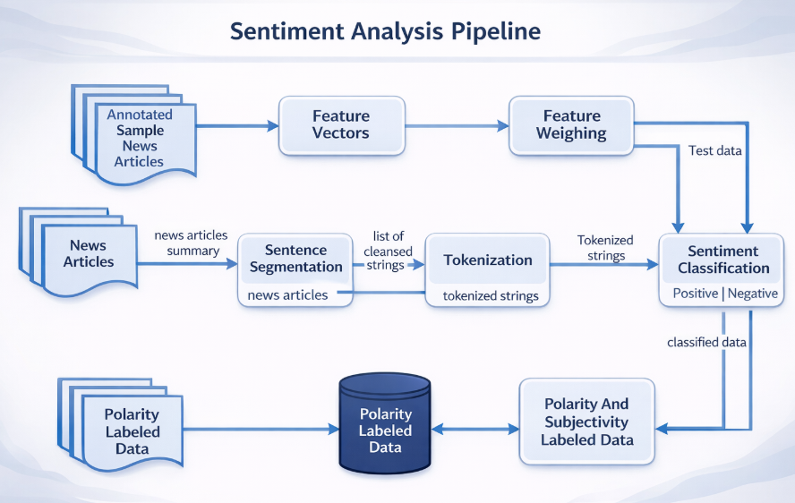

# 🤖 AI-Powered Sentiment Analysis of App Reviews

## 📌 Project Overview
This project uses Artificial Intelligence and Natural Language Processing (NLP) to analyze user reviews and automatically classify sentiment as **Positive**, **Neutral**, or **Negative**.

The goal is to demonstrate how AI can be applied to unstructured text data to generate actionable business insights.

---

## 🔄 Project Flow

---

## 🎯 Business Problem
User reviews contain valuable feedback but are difficult to analyze manually at scale.
This project automates sentiment analysis to help identify:
- Customer satisfaction trends
- Common complaints and issues
- Opportunities for product improvement

---

## 🧠 AI Approach
- Prompt-based sentiment classification using a Large Language Model (LLM)
- Automated labeling of text reviews
- Analysis of sentiment distribution

---

## 🛠️ Tools & Technologies
- Python
- Pandas
- Jupyter Notebook
- AI / NLP (LLM-based sentiment analysis)
- Matplotlib / Seaborn
